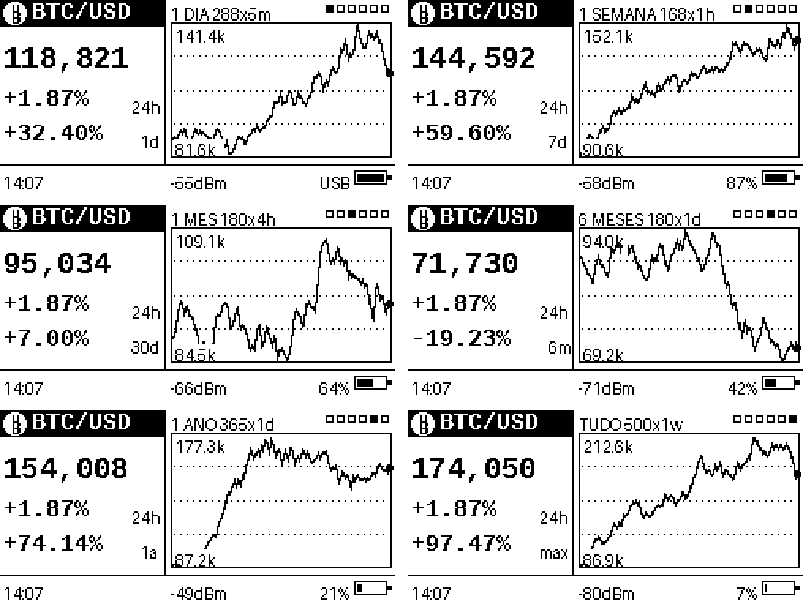

# BTC Dashboard — LilyGO T5 2.13" E-Paper

Mini dashboard de Bitcoin para ESP32 com display e-paper de 2,13". Mostra o preço
atual em dólar, a variação de 24 h e um gráfico do histórico — com seis janelas de
tempo selecionáveis pelo botão da placa.



*Simulação do layout nos seis períodos, com estados variados de bateria e sinal
(dados sintéticos, ampliado 2x).*

## Funcionalidades

- Preço BTC/USD e variação de 24 h, atualizados a cada 60 s
- Gráfico de linha com seis períodos: **1 dia · 1 semana · 1 mês · 6 meses · 1 ano · tudo**
- Troca de período pelo botão da placa (GPIO39), sem recompilar
- Variação percentual do período selecionado
- Refresh **parcial** só na área do preço — rápido e com pouco ghosting
- Indicador de bateria com porcentagem e ícone de pilha
- Relógio via NTP e força do sinal WiFi no rodapé
- Sem chave de API: usa os endpoints públicos da Binance

## Hardware

- **LilyGO TTGO T5 v2.3** (ESP32) com painel e-paper 2,13" B/W
- Painel **DEPG0213BN** (DKE), 122×250 — usado em rotação 1, ou seja 250×122

### Pinagem (já definida no sketch)

| Sinal | GPIO |
|---|---|
| MOSI | 23 |
| MISO | — (não usado) |
| CLK | 18 |
| CS | 5 |
| BUSY | 4 |
| RESET | 16 |
| DC | 17 |
| Botão | 39 |
| Bateria (ADC) | 35 |

Se o seu T5 usa outro painel (GDEM0213B74, GDEH0213B73, GxEPD2_213_flex), troque a
linha `#define PANEL` no início do sketch.

## Dependências

- Arduino IDE 2.x (ou arduino-cli)
- Core **ESP32 3.x** da Espressif
- [GxEPD2](https://github.com/ZinggJM/GxEPD2) (Jean-Marc Zingg)
- [Adafruit GFX Library](https://github.com/adafruit/Adafruit-GFX-Library)

> A biblioteca antiga **GxEPD** (sem o "2") não compila no core 3.x. Use a GxEPD2.

## Como usar

1. Clone o repositório numa pasta chamada `BTCdashboard` (o Arduino exige que a
   pasta tenha o mesmo nome do `.ino`):

   ```bash
   git clone https://github.com/<usuario>/BTCdashboard.git
   ```

2. Copie `secrets.example.h` para `secrets.h` e preencha com a sua rede:

   ```cpp
   const char* WIFI_SSID = "sua-rede-2.4GHz";
   const char* WIFI_PASS = "sua-senha";
   ```

   O `secrets.h` está no `.gitignore` — suas credenciais não vão para o git.
   Lembre que o ESP32 só conecta em 2,4 GHz.

3. Selecione a placa **ESP32 Dev Module** e faça o upload. O monitor serial a
   115200 mostra o diagnóstico.

## Botão (GPIO39)

| Ação | Efeito |
|---|---|
| Clique curto | Próximo período do gráfico |
| Segurar > 800 ms | Recarrega o período atual |

Os seis quadradinhos no canto superior direito indicam a posição no ciclo.

## Períodos e dados

A Binance devolve sempre os candles mais recentes quando passamos apenas `limit`,
então cada período é uma combinação de intervalo × quantidade:

| Período | Candles | Janela |
|---|---|---|
| 1 dia | 288 × `5m` | 24 h |
| 1 semana | 168 × `1h` | 7 dias |
| 1 mês | 180 × `4h` | 30 dias |
| 6 meses | 180 × `1d` | ~6 meses |
| 1 ano | 365 × `1d` | 1 ano |
| Tudo | 500 × `1w` | ~9,5 anos (todo o par BTCUSDT) |

Endpoints usados:

- `GET /api/v3/ticker/24hr?symbol=BTCUSDT` — `lastPrice` e `priceChangePercent`
- `GET /api/v3/klines?symbol=BTCUSDT&interval=…&limit=…` — histórico

## Notas de implementação

Dois detalhes que custaram algum tempo e podem ser úteis para quem usa o mesmo painel.

### 1. Alinhamento de 8 px da janela parcial

A GxEPD2 arredonda a janela de refresh parcial para múltiplos de 8 px **no eixo
nativo do painel**, não no eixo lógico depois da rotação. Em rotação 1 o Y lógico
vira o X nativo:

```
x_nativo = 122 - y_logico - altura
```

Uma janela `(0, 17, 104, 105)` vira, em coordenadas nativas, `x=0, w=105`, que é
arredondado para `w=112` — esticando a região de volta até o Y lógico 10 e apagando
parte do cabeçalho a cada atualização.

**Regra prática para este painel em rotação 1:** `(122 − y)` e a altura precisam
ser múltiplos de 8. A janela do preço usa `(0, 18, 104, 104)`, que fecha exato.

### 2. Porcentagem de bateria por tabela, não por regra de três

A bateria chega ao **GPIO35** (ADC1, então continua funcionando com o WiFi
ligado) por um divisor 1:2. A leitura usa `analogReadMilliVolts()`, que já aplica
a calibração de fábrica gravada na eFuse — nada de fator empírico em cima do
`analogRead()` cru. Como uma amostra isolada oscila uns 50 mV, o sketch tira a
média de 16 leituras.

Converter tensão em porcentagem de forma linear entre 4,2 e 3,3 V erra bastante:
a célula LiPo passa metade da vida útil entre 3,9 e 3,7 V. O código interpola numa
tabela de descarga (`LIPO[]`), o que dá um número bem mais próximo da realidade na
região plana da curva.

`BATT_DIV` é o ponto de ajuste fino se o multímetro discordar da leitura.

### 3. Parser em streaming para os klines

A resposta de `/klines` chega a ~55 KB no período de 1 dia. Carregar isso como
String e jogar num parser de JSON compete por heap com o TLS e com o buffer do
painel. O sketch lê o stream HTTP byte a byte, acompanha a profundidade dos
colchetes e captura apenas o campo 4 de cada linha (preço de fechamento) — o
consumo de RAM fica no array de floats, independente do tamanho da resposta.

## Problemas comuns

| Sintoma | Causa provável |
|---|---|
| Serial mostra `ticker HTTP 451` ou `HTTP 403` | A Binance bloqueia algumas regiões/IPs. Troque para outra API (CoinGecko, CoinCap). |
| Não conecta no WiFi | Rede em 5 GHz — o ESP32 só faz 2,4 GHz. |
| Tela em branco ou com lixo | `#define PANEL` errado para o seu display. |
| Parte do texto some no refresh parcial | Janela parcial desalinhada — veja a nota 1 acima. |
| Erro de compilação em `GxEPD.h` | Está usando a biblioteca antiga; instale a GxEPD2. |
| Bateria mostra `USB` sempre | Alimentação externa mantém o pino acima de 4,25 V — comportamento esperado com o cabo ligado. |
| Porcentagem de bateria não bate com o multímetro | Ajuste `BATT_DIV` (padrão 2.0, do divisor 1M/1M). |

## Licença

MIT — veja [LICENSE](LICENSE).
